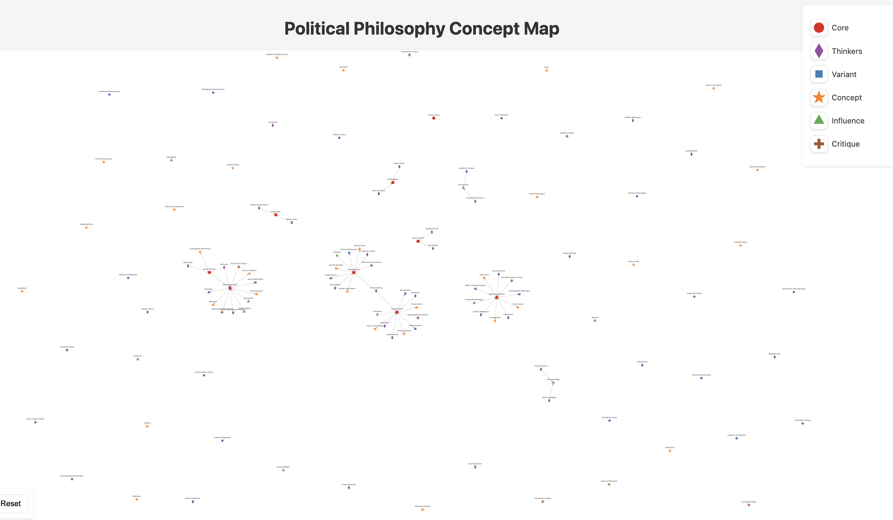

<!-- Slide 1: Title Slide -->
<section data-background-image="image1.png" 
         data-background-size="cover" 
         data-background-position="center">
  <h2 style="color: #fff; text-shadow: 2px 2px 4px #000;">Negation Voice</h2>
  
Enhancing DAO Governance with Semantic Tools

</section>

---

<!-- Slide 2: Who We Are -->
<section>
  <h2>Who We Are: Factory Labs</h2>
  <ul>
    <li>London-based blockchain & AI research company</li>
    <li>Mission: Build tools to enhance <strong>collective intelligence</strong></li>
    <li>Focused on governance-minimized, modular systems</li>
  </ul>
  
Led by scientists, engineers, and governance experts bridging theory with practical tools.

</section>

---

<!-- Slide 3: The Problem -->
<section>
  <h2>The Problem with DAO Governance</h2>
  <ul>
    <li>Surface-level voting lacks nuance</li>
    <li>Deliberations are slow and noisy</li>
    <li>Scaling decisions to larger communities remains unsolved</li>
  </ul>
</section>

---

<!-- Slide 4: Our Solution -->
<section>
  <h2>Introducing Negation Voice</h2>
  
A dual-tool governance experience:

  <ul>
    <li><strong>#VOICE</strong>: Semantic Ballot Voting (SBV) with AI-enhanced insights</li>
    <li><strong>The Negation Game</strong>: Structured protocol to refine and challenge beliefs</li>
  </ul>
</section>

---

<!-- Slide 5: What is #VOICE? -->
<section>
  <h2>#VOICE: Governance Built on Preferences</h2>
  
Semantic Ballot Voting enables communities to:

  <ul>
    <li>Vote across <strong>semantic tags</strong> to signal nuanced priorities</li>
    <li>Use <strong>Quadratic Voting</strong> to balance preference intensity</li>
    <li>Visualize votes as a <strong>preference graph</strong> for actionable insights</li>
  </ul>
</section>

---

<!-- Slide 6: How SBV Works -->
<section>
  

    

      <h2>How SBV Works</h2>
      <ul>
        <li>Vote budget allocated across semantic tags</li>
        <li>Quadratic costs reveal true priorities</li>
        <li>Graph analysis connects and clusters preferences</li>
      </ul>
    

    

      
      
Visualizing community preferences

    

  

</section>

---

<!-- Slide 7: Why SBV is a Game-Changer -->
<section>
  <h2>Why SBV for ScrollDAO?</h2>
  <ul>
    <li><strong>Data-Driven Governance:</strong> Understand what matters and why</li>
    <li><strong>AI Integration:</strong> NLP tools extract qualitative insights</li>
    <li><strong>Public Goods Tool:</strong> Scalable and modular for future DAOs</li>
  </ul>
</section>

---

<!-- Slide 8: The Negation Game -->
<section>
  <h2>The Negation Game: A Governance Filter</h2>
  <ul>
    <li>Participants challenge and refine community claims</li>
    <li>Falsification and bargaining ensure rigorous preference testing</li>
    <li>Outputs a validated set of <strong>consensus-driven beliefs</strong></li>
  </ul>
</section>

---

<!-- Slide 9: Why Both Tools Matter -->
<section>
  <h2>#VOICE + The Negation Game</h2>
  
By running both tools, ScrollDAO gains:

  <ul>
    <li><strong>What the community values</strong> (SBV results)</li>
    <li><strong>What the community rejects</strong> (Negation insights)</li>
    <li>A multi-dimensional governance process that evolves iteratively</li>
  </ul>
</section>

---

<!-- Slide 10: Budget and Ask -->
<section>
  <h2>The Ask</h2>
  <ul>
    <li><strong>Total Funding:</strong> $100,000</li>
    <li>Phase 1: SBV Core Build and NLP Integration</li>
    <li>Phase 2: IRL/Online Experiments + Community Refinement</li>
  </ul>
  
Empower ScrollDAO to pioneer AI-enhanced, scalable governance tools.

</section>

---

<!-- Slide 11: Long-Term Impact -->
<section>
  <h2>Why This Matters for Scroll</h2>
  <ul>
    <li>Strengthens governance infrastructure</li>
    <li>Delivers open-source tools as public goods</li>
    <li>Positions ScrollDAO as an innovator in semantic governance</li>
  </ul>
</section>

---

<!-- Slide 12: Closing Slide -->
<section data-background-color="#000" style="text-align: center;">
  <h2 style="color: #fff; font-size: 2.5em;">Negation Voice</h2>
  
Let’s shape governance together with clarity, nuance, and rigor.

</section>
