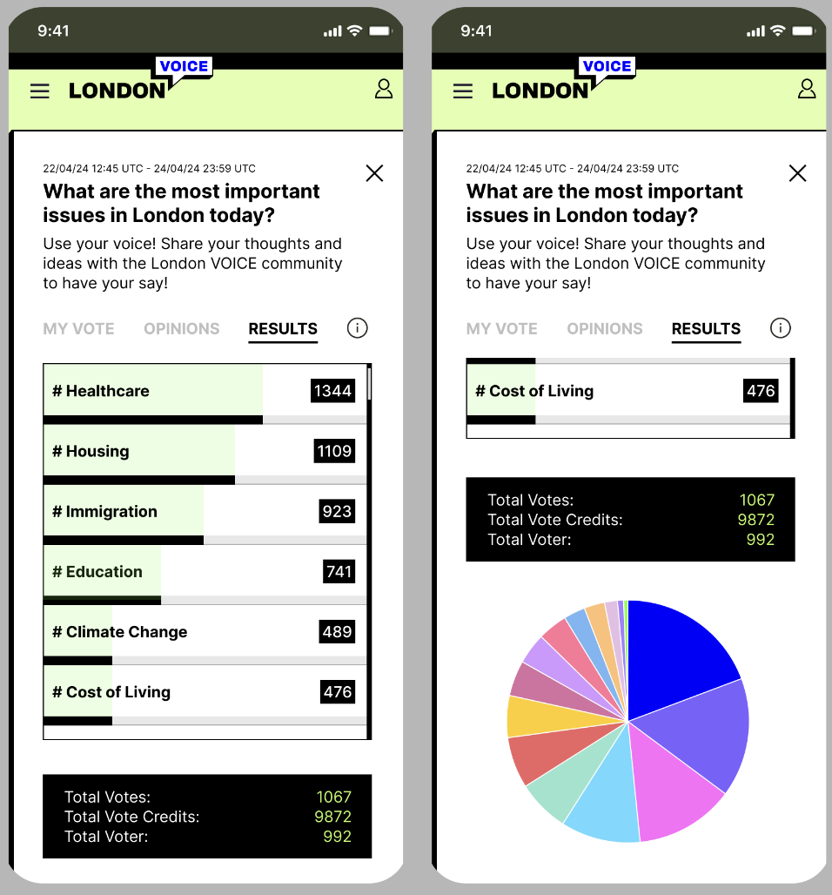
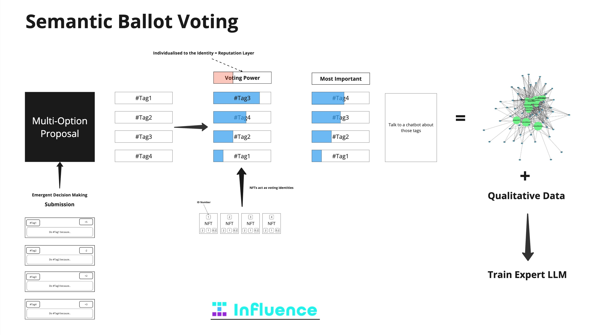

<!-- Title Slide -->
<section data-transition="slide" style="text-align:center;">
  <h1>#VOICE</h1>
  
An Application for Preference Signaling and Participatory Governance

  
Pioneering the next generation of decision-making with Semantic Ballot Voting

  
</section>

<!-- The Problem -->
<section data-transition="slide" data-background-color="#f0f0f0">
  <h2>The Problem: Governance Today</h2>
  <ul style="line-height:1.6; padding-left:1.5em; text-align:left; max-width:60%; margin:auto;">
    <li>Current tools simplify governance to binary outcomes</li>
    <li>Communities fail to capture nuanced preferences</li>
    <li>Decision-making lacks systemic alignment with long-term priorities</li>
  </ul>
</section>

<!-- What is #VOICE? -->
<section data-transition="slide" data-background-color="#e1f5fe">
  

    <!-- Text Column -->
    

      <h2>What is #VOICE?</h2>
      
A platform for preference signaling that captures and visualizes complex community priorities.

      <ul style="line-height:1.6; padding-left:1.5em;margin-top:1em;">
        <li style="margin-bottom:0.5em;">Uses Semantic Ballot Voting (SBV) to go beyond traditional decision-making</li>
        <li style="margin-bottom:0.5em;">Generates semantic graphs to uncover hidden consensus</li>
        <li>Empowers communities to articulate and align priorities</li>
      </ul>
    

    <!-- Image Column -->
    

      
    

  

</section>

<!-- The Mathematics of SBV -->
<section data-transition="slide" data-background-color="#ffffff">
  <h2>The Mathematics of Semantic Ballot Voting</h2>
  <ul style="line-height:1.6; padding-left:1.5em; max-width:70%; margin:auto;">
    <li>Each participant \( p_j \) has a voting budget \( B_j \).</li>
    <li>Votes are distributed across semantic tags \( t_i \), where the cost of \( v_{j,i} \) votes grows quadratically:</li>
  </ul>
  

    \[
    \text{Cost}_{j,i} = v_{j,i}^2 \quad \text{such that} \quad \sum_{i} v_{j,i}^2 \leq B_j
    \]
  

  <ul style="line-height:1.6; padding-left:1.5em; max-width:70%; margin:auto;">
    <li>Semantic tags form a weighted preference graph \( G = (T, E) \):</li>
  </ul>
  

    \[
    w_{i,k} = \sum_{j} \frac{v_{j,i} \cdot v_{j,k}}{B_j}
    \]
  

  
Captures relationships between preferences to reveal hidden consensus.

</section>

<!-- Public Goods Funding with SBV -->
<section data-transition="slide" data-background-color="#e8f5e9">
  <h2>Public Goods Funding with Semantic Ballot Voting</h2>
  

    SBV identifies systemic priorities, uncovering critical but underfunded areas:
  

  <ul style="line-height:1.6; padding-left:1.5em; max-width:70%; margin:auto;">
    <li style="margin-bottom:0.5em;">Ensures diversity of funding through quadratic cost functions</li>
    <li style="margin-bottom:0.5em;">Preference graphs highlight thematic clusters and systemic priorities</li>
    <li>Aligns capital to projects with hidden but vital contributions</li>
  </ul>
  

    
  

</section>

<!-- How #VOICE Works -->
<section data-transition="slide" data-background-color="#ffffff">
  

    

      <h2>How #VOICE Works</h2>
      <ul style="line-height:1.6; padding-left:1.5em;">
        <li style="margin-bottom:0.5em;">Participants allocate votes across semantic tags</li>
        <li style="margin-bottom:0.5em;">Quadratic costs promote balanced preferences</li>
        <li>Results form semantic preference graphs that visualize community priorities</li>
      </ul>
    

    

      
      
Visualizing values, not just votes

    

  

</section>

<!-- Real World Impact and Onboarding -->
<section data-transition="slide" data-background-color="#c8e6c9">
  <h2>Real-World Impact and Onboarding</h2>
  

    By adopting #VOICE, Scroll gains:
  

  <ul style="line-height:1.6; padding-left:1.5em; max-width:70%; margin:auto; margin-top:1em;">
    <li style="margin-bottom:0.5em;"><strong>Enhanced Community Engagement:</strong> Uncover nuanced preferences</li>
    <li style="margin-bottom:0.5em;"><strong>Effective Decision-Making:</strong> Align priorities with actionable outcomes</li>
    <li><strong>Scalable Onboarding:</strong> Bring new communities into Scroll with clear, data-driven insights</li>
  </ul>
</section>

<!-- Background Image Slide -->
<section data-background-image="LV.png" data-background-size="cover" data-background-position="center">
  <h2 style="color: #fff; text-shadow: 2px 2px 4px #000;">Empowering Communities</h2>
  
Achieving clarity through participatory governance.

</section>

<!-- Closing -->
<section data-transition="slide" data-background-color="#f48fb1" style="text-align:center;">
  <h2>#VOICE</h2>
  
Shape the future of governance with nuance, depth, and transparency

  
Join us in building lasting infrastructure for better decisions

</section>
