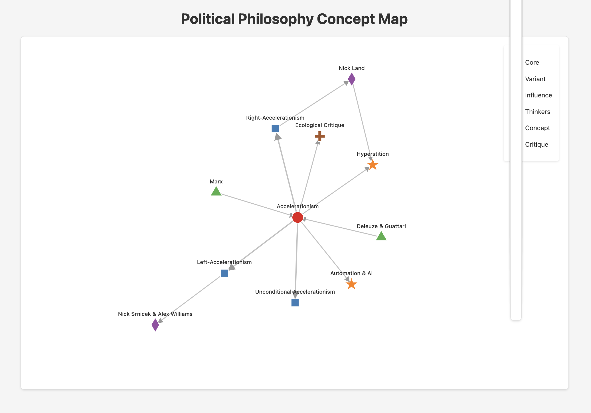

<!-- Slide 1: Title -->
<section data-transition="slide" style="text-align:center;">
  <h1>#VOICE</h1>
  
Redefining Governance with Semantic Ballot Voting (SBV)

  
Uncover nuanced, multi-dimensional preferences.

</section>

---

<section data-background-image="image3.png" 
         data-background-size="cover" 
         data-background-position="center" 
         data-transition="slide">
  <h2 style="color: #fff; text-shadow: 2px 2px 4px rgba(0, 0, 0, 0.7); text-align: center; font-size: 2.5em;">
    Semantic Governance
  </h2>
</section>

---
<section data-background-image="image3.png" 
         data-background-size="cover" 
         data-background-position="center">
  <h2 style="color: #fff; text-shadow: 2px 2px 4px #000;">Semantic Governance</h2>
  
Exploring a new paradigm of decision-making

</section>

---

<section>
  <h2>Visualizing Data-Driven Governance</h2>
  <figure style="display: flex; flex-direction: column; align-items: center;">
    
    <figcaption style="font-style: italic; margin-top: 0.5em;">A futuristic depiction of interconnected governance.</figcaption>
  </figure>
  
Using structured semantic tags and AI to reveal systemic priorities and emergent consensus.

</section>

---
<!-- Slide 2: The Problem -->
<section data-transition="slide" data-background-color="#f0f0f0">
  <h2>Governance Needs Depth</h2>
  <ul style="line-height:1.6; text-align:left; max-width:70%; margin:auto;">
    <li>Traditional voting reduces complexity to binary outcomes, ignoring nuanced preferences.</li>
    <li><strong>Popularity bias:</strong> Critical but less visible contributions are often sidelined.</li>
    <li>Decisions lack contextual insights, leading to misaligned priorities.</li>
  </ul>
</section>

<!-- Slide 3: What is #VOICE? -->
<section data-transition="slide" data-background-color="#e1f5fe">
  <h2>A Multi-Dimensional Governance Solution</h2>
  <ul style="line-height:1.6; text-align:left; max-width:70%; margin:auto;">
    <li><strong>Semantic Ballot Voting (SBV):</strong> Allocate votes across thematic tags representing decision axes.</li>
    <li>Combines quantitative voting (quadratic cost) with qualitative reasoning (NLP analysis).</li>
    <li>Creates a preference-weighted graph, visualizing community priorities and interconnections.</li>
  </ul>
</section>

<!-- Slide 4: How SBV Works -->
<section data-transition="slide" data-background-color="#fff">
  

    

      <h2>Revolutionizing Voting with Data-Rich Insights</h2>
      <ul style="line-height:1.6;">
        <li>Participants receive a finite voting budget to allocate across semantic tags.</li>
        <li>Quadratic voting ensures thoughtful prioritization (\( \text{Cost}_{j,i} = v_{j,i}^2 \)).</li>
        <li>Votes form a semantic graph: nodes as tags, edges as co-preferences.</li>
        <li>NLP extracts themes, sentiments, and contextual reasoning for richer insights.</li>
      </ul>
    

    

      
      
Turning data into actionable insights.

    

  

</section>

<!-- Slide 5: Why SBV? -->
<section data-transition="slide" data-background-color="#ffecb3">
  <h2>Uncovering Hidden Value and Bridging Gaps</h2>
  <ul style="line-height:1.6; text-align:left; max-width:70%; margin:auto;">
    <li>Highlights systemic priorities over surface-level popularity.</li>
    <li>Reveals hidden connections between themes for informed decision-making.</li>
    <li>Captures both quantitative preferences and qualitative context for holistic governance.</li>
  </ul>
</section>

<!-- Slide 6: Real-World Applications -->
<section data-transition="slide" data-background-color="#c8e6c9">
  <h2>Semantic Governance in Action</h2>
  

    <strong>Use Case:</strong> Public goods funding for Scroll.
  

  <ul style="line-height:1.6; max-width:70%; margin:auto;">
    <li>Semantic tags like #DeveloperTools, #SecurityAudits, and #Infrastructure.</li>
    <li>Preference-weighted graph identifies bridging priorities, e.g., #DeveloperTools connecting security and upgrades.</li>
    <li><strong>Outcome:</strong> Funding decisions align with long-term ecosystem health.</li>
  </ul>
</section>

<!-- Slide 7: Key Features -->
<section data-transition="slide" data-background-color="#d1c4e9">
  <h2>Why Choose #VOICE?</h2>
  <ul style="line-height:1.6; max-width:70%; margin:auto;">
    <li><strong>Actionable Insights:</strong> Graph-based analysis reveals emergent themes and systemic importance.</li>
    <li><strong>Sybil Resistance:</strong> Identity gating ensures fair, secure participation.</li>
    <li><strong>AI-Driven Context:</strong> NLP enriches decisions with thematic and sentiment analysis.</li>
  </ul>
</section>

<!-- Slide 8: Roadmap -->
<section data-transition="slide" data-background-color="#ffe0b2">
  <h2>From Concept to Deployment</h2>
  <ul style="line-height:1.6; max-width:70%; margin:auto;">
    <li><strong>Phase 1:</strong> Build core SBV engine with quadratic voting and semantic tags.</li>
    <li><strong>Phase 2:</strong> Integrate NLP for sentiment and theme extraction.</li>
    <li><strong>Phase 3:</strong> Develop dashboards and thematic visualizations.</li>
    <li><strong>Phase 4:</strong> API and governance plugins for scalability.</li>
  </ul>
  
MVP ready in ~8 weeks.

</section>

<!-- Slide 9: The Ask -->
<section data-transition="slide" data-background-color="#b2ebf2">
  <h2>Support the Next Generation of Governance</h2>
  <ul style="line-height:1.6; max-width:70%; margin:auto;">
    <li><strong>Funding:</strong> $100K to complete development and launch.</li>
    <li><strong>Collaboration:</strong> Pilot with Scroll DAO to validate and scale.</li>
    <li><strong>Impact:</strong> Enable aligned capital flows and systemic decision-making.</li>
  </ul>
</section>

<!-- Slide 10: Conclusion -->
<section data-transition="slide" data-background-color="#f48fb1">
  <h2>Pioneering Semantic Governance</h2>
  <ul style="line-height:1.6; max-width:70%; margin:auto;">
    <li>#VOICE transforms governance into a semantic, data-driven process.</li>
    <li>Build better decisions through nuanced, multi-dimensional insights.</li>
    <li><strong>Call to Action:</strong> Join us in pioneering sustainable governance frameworks.</li>
  </ul>
</section>
