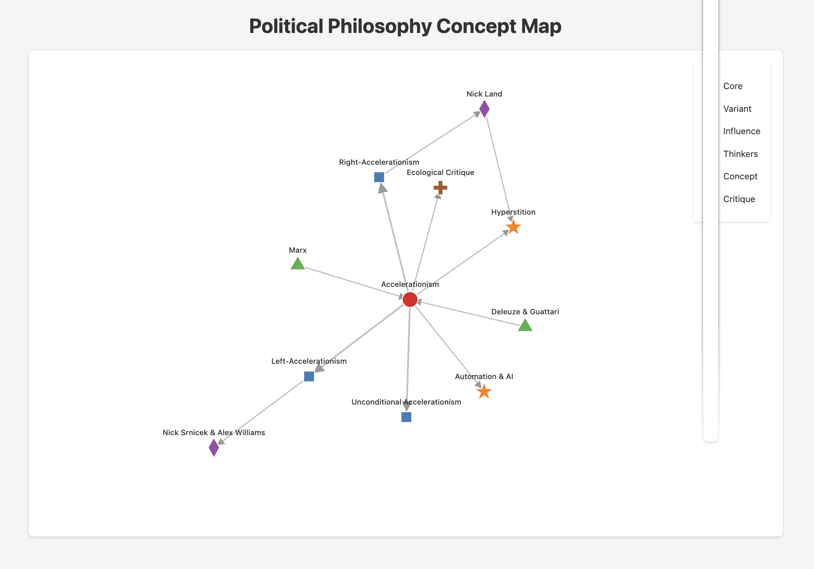

<section>
  <h1>#VOICE</h1>
  
Unleash the power of nuanced, multi-dimensional voting

  
Reinvent how communities discover what truly matters

</section>

<section data-background-color="#222" data-transition="fade">
  <h2 style="color:#fff;">Why Settle for Simple "Yes" or "No"?</h2>
  <ul style="line-height:1.6; font-size:1.3em; color:#fff;">
    <li style="margin-bottom:0.5em;">Most voting is flat, losing the richness of real-world opinions</li>
    <li style="margin-bottom:0.5em;">Trends, nuance, and hidden priorities vanish in a single checkbox</li>
  </ul>
</section>

<section data-background="#1B9CFC" data-background-transition="zoom">
  <h2 style="color:#fff;">#VOICE: The Semantic Ballot</h2>
  
Allocate votes across multiple tags—no one-dimensional choices. Embrace complexity!

</section>

<section style="display:flex; align-items:center; justify-content:space-between;">
  

    <h2>Magic of Quadratic Voting</h2>
    <ul style="line-height:1.6; padding-left:1.5em;">
      <li style="margin-bottom:0.5em;">More votes cost more—no more hyper-concentration on a single pick</li>
      <li style="margin-bottom:0.5em;">Reveal true preference strength, not just popularity</li>
    </ul>
  

  

    
    
It’s about depth, not just breadth

  

</section>

<section data-background-color="#eee">
  <h2>Semantic Hypergraph of Preferences</h2>
  
Your votes build a dynamic map of values—nodes as priorities, edges as co-preferences.

  <ul style="line-height:1.6; padding-left:1.5em;">
    <li style="margin-bottom:0.5em;">See how ideas interconnect</li>
    <li style="margin-bottom:0.5em;">Spot hidden consensus & bridging topics</li>
    <li>Discover emergent themes that simple polls never reveal</li>
  </ul>
</section>

<section data-background="#3B3B98" data-transition="slide">
  <h2 style="color:#fff;">Data-Driven Insights</h2>
  

    Plug #VOICE into NLP & AI tools to decode reasoning, sentiment, and context.
  

  
It’s not just voting—it’s meaningful, actionable intelligence.

</section>

<section data-background="#2ecc71" data-transition="convex">
  <h2 style="color:#fff;">Empower Your Community</h2>
  <ul style="line-height:1.6; padding-left:1.5em; color:#fff;">
    <li style="margin-bottom:0.5em;">Reflect true collective will</li>
    <li style="margin-bottom:0.5em;">Shape decisions grounded in rich, authentic data</li>
    <li>Unleash a future-proof model for governance & collaboration</li>
  </ul>
</section>

<section>
  <h2>#VOICE: Join the Revolution</h2>
  
Go beyond binary votes. Capture real values. Build better decisions.

  
The future of voting is semantic. Your voice, amplified.

</section>
