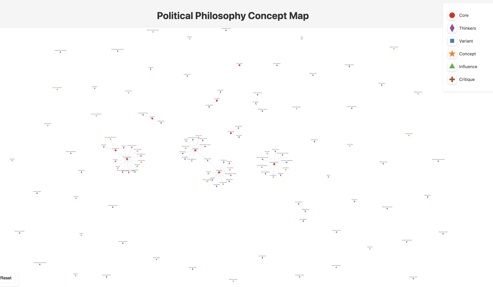

# My Presentation

---

## Introduction

This slide introduces the topic.

    

---
## The Lorenz Equations

<section>
  <h2>The Lorenz Equations</h2>
  \[
  \begin{aligned}
  \dot{x} & = \sigma(y-x) \\
  \dot{y} & = \rho x - y - xz \\
  \dot{z} & = -\beta z + xy
  \end{aligned}
  \]
</section>

---

## Conclusion

This slide wraps up the presentation 🤝.

    

---

    

